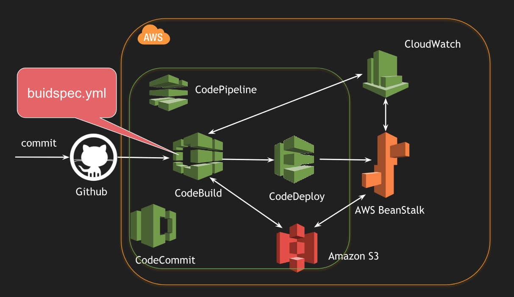

# Continuous Integration and Continuous Deployment using AWS CodePipeline Example

## Architecture

## Flow
- Source: Github
- Continuous Integration: AWS CodeBuild - leveraged `buildspec.yml` to build the codebase
- Continuous Deployment: AWS CodeDeploy - leveraged Amazon Elastic BeanStalk for deployment

## REST Endpoints
- Actuator endpoints are enabled under `/actuator/*`
- Sample `HelloController` enabled under `/hello`